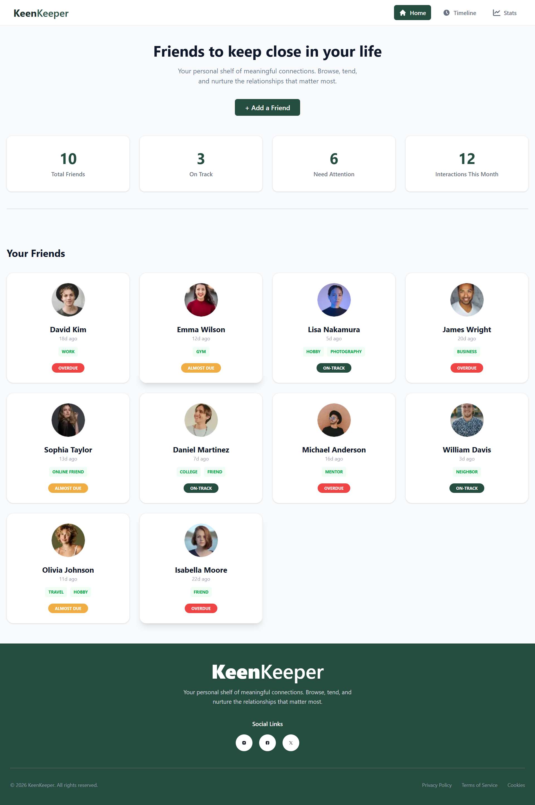

<div align="center">

# 🌿 KeenKeeper
### *Keep Your Friendship Alive, Effortlessly.*

[]()
[]()
[]()
[]()

*KeenKeeper is a dedicated Relationship Management platform designed to bridge the gap between busy schedules and meaningful human connections.*

</div>

---

## 📖 About the Project
**KeenKeeper** acts as your personal relationship assistant. Instead of letting friendships drift, KeenKeeper provides a structured timeline, intelligent interaction tracking, and beautiful data visualization to ensure you remain an active part of your friends' and colleagues' lives.

---

## 🛠 Tech Stack
We rely on a robust tech stack to provide a lightning-fast and visually rich user experience:

| Technology | Purpose |
| :--- | :--- |
| **Next.js 15** | Server-side rendering & optimized routing |
| **Tailwind CSS** | Crafting a modern, responsive interface |
| **DaisyUI** | High-quality UI components for a polished design |
| **Recharts** | Visualizing interaction patterns with elegant PieCharts |
| **Context API** | Managing dynamic interaction states globally |

---

## 📸 Previews of the App
<div align="center">
<table border="0">
<tr>
<td width="50%">

<p align="center"><em>1. Dashboard Overview</em></p>
</td>
<td width="50%">

<p align="center"><em>2. Friendship Analytics</em></p>
</td>
</tr>
<tr>
<td width="50%">

<p align="center"><em>3. Interaction Timeline</em></p>
</td>
<td width="50%">

<p align="center"><em>4. Friend Detail Page</em></p>
</td>
</tr>
</table>
</div>

---

## ✨ Key Features

### 1. 📊 Insightful Data Visualizations
Leveraging **Recharts**, KeenKeeper offers an intuitive dashboard where you can visualize your interaction frequency through dynamic and interactive PieCharts.

### 2. 📜 Intelligent Interaction Timeline
Every interaction is logged dynamically. Whether it’s a quick catch-up call or a long text conversation, the timeline tracks your history with a powerful filtering system.

### 3. 🎯 Relationship Goal Setting
Set "Connect every X days" goals. Our system monitors your "Days Since Last Contact" and alerts you when it’s time to reach out, keeping your social life organized.

### 4. 📈 Comprehensive Friendship Analytics
Unlock deeper insights into your social habits. Our dedicated Stats page provides a high-level overview of your networking style—analyzing communication preferences and engagement consistency to help you become a better friend.

---

## 💻 Getting Started

### Installation

1. **Clone the repo:**
   ```bash
   git clone [https://github.com/fireflyurmi/keen-keeper-project.git](https://github.com/fireflyurmi/keen-keeper-project.git)
